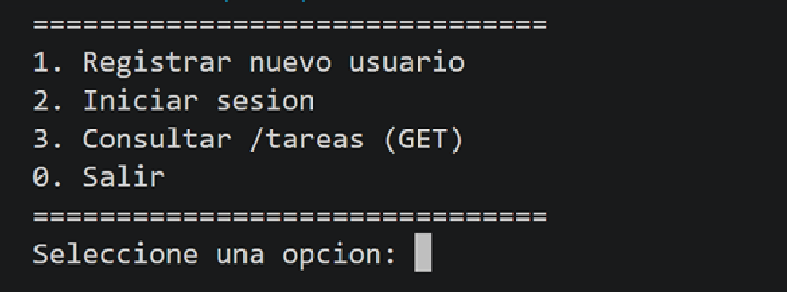

# PFO 2: Sistema de Gestión de Tareas con API y Base de Datos

Implementación de una API REST utilizando Flask y persistencia en SQLite, con autenticación básica mediante contraseñas hasheadas y un cliente interactivo por consola.

---

## 🛠️ Tecnologías utilizadas

- **Python 3.10+**
- **Flask**: microframework web para la API REST.
- **SQLite3**: motor de base de datos relacional ligero embebido.
- **Werkzeug**: funciones criptográficas para el hashing y verificación segura de credenciales.
- **Requests**: cliente HTTP para interactuar desde consola con los endpoints.

---

## 📁 Estructura del proyecto

```text
pfo2-gestion-tareas/
├── img/                    # Capturas de pantalla de pruebas
│   ├── endpoint - bienvenida.png
│   ├── endpoint - login exitoso.png
│   ├── endpoint - registro.png
│   ├── endpoint-proceso login.png
│   └── menu-principal.png
├── static/
│   └── styles.css          # Estilos visuales para la vista web
├── templates/
│   └── tareas.html         # Vista HTML de bienvenida (GET /tareas)
├── venv/                   # Entorno virtual (ignorado en Git)
├── .gitignore              # Reglas de exclusión de Git
├── cliente.py              # Cliente interactivo en consola
├── database.db             # Base de datos SQLite local (autogenerada)
├── README.md               # Documentación del proyecto
├── requirements.txt        # Dependencias del proyecto
├── servidor.py             # Servidor Flask y lógica de base de datos
└── .git/
```

---

## 🚀 Instrucciones para ejecutar y probar el proyecto

### 1. Requisitos previos y configuración

Asegurate de tener Python 3.10 o superior instalado. Luego creá y activá el entorno virtual e instalá las dependencias:

```bash
# Crear el entorno virtual
python -m venv venv

# Activar el entorno virtual
# En Git Bash:
source venv/Scripts/activate
# O en PowerShell:
.\venv\Scripts\Activate.ps1

# Instalar dependencias
pip install -r requirements.txt
```

### 2. Iniciar el servidor API

```bash
python servidor.py
```

El servidor queda corriendo en `http://localhost:5000`.

### 3. Ejecutar el cliente de consola

Abrí otra terminal, activá el entorno virtual y ejecutá:

```bash
python cliente.py
```

A través del menú numérico se prueban los endpoints funcionales del trabajo práctico:

1. **Registro de usuarios**: `POST /registro`
   - Solicita usuario y contraseña.
   - Envía el payload JSON al servidor.
   - La contraseña se hashea antes de almacenarse en SQLite.
   - Devuelve `201 Created` si tuvo éxito o `409 Conflict` si el usuario ya existe.

2. **Inicio de sesión**: `POST /login`
   - Solicita credenciales.
   - Verifica el hash almacenado con `check_password_hash`.
   - Devuelve `200 OK` si son correctas o `401 Unauthorized` si no coinciden.

3. **Consulta de tareas**: `GET /tareas`
   - Realiza la petición GET a la ruta `/tareas`.
   - Muestra el código HTTP recibido y confirma la vista HTML.

4. **Probar la vista web**
   - Con el servidor corriendo, abrí tu navegador y accedé a:
   - `http://localhost:5000/tareas`

---

## 📸 Capturas de pruebas exitosas




> Nota: en GitHub es recomendable usar rutas relativas como `./img/...` en lugar de `/img/...`, porque la barra inicial apunta a la raíz del dominio y no al repositorio local. También conviene evitar espacios en los nombres de archivo si se quiere simplificar el manejo de rutas.
